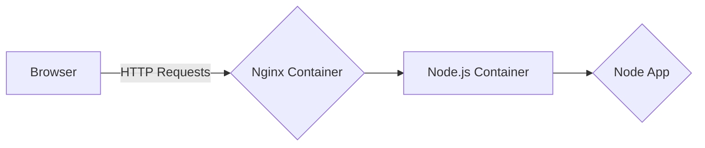

# Docker Tutorial for CMSC389T Project

This is a tutorial for using Docker to containerize your web application. It is intended for students in CMSC389T at the University of Maryland.

## Understanding the Dockerfile

A Dockerfile is a text document containing all the commands a user could call to assemble an image. Here's a breakdown of each part:

### FROM

```dockerfile
FROM node:10-alpine
```

- Specifies the base image for your Docker image. In this case, `node:10-alpine` is a lightweight version of the Node.js 10 image.

### RUN

```dockerfile
RUN mkdir -p /home/node/app && chown -R node:node /home/node/app
```

- Executes shell commands in the container. Here, it creates a directory `/home/node/app` and sets its owner to the `node` user.

### WORKDIR

```dockerfile
WORKDIR /home/node/app
```

- Sets the working directory for the subsequent Dockerfile commands.

### COPY

```dockerfile
COPY package*.json ./
```

- Copies `package.json` and `package-lock.json` (if available) from your project directory into the container.

### USER

```dockerfile
USER node
```

- Switches to the `node` user for security purposes.

### RUN (npm install)

```dockerfile
RUN npm install
```

- Installs the dependencies defined in `package.json`.

### EXPOSE

```dockerfile
EXPOSE 8080
```

- Informs Docker that the container listens on port 8080 at runtime.

### COPY (App Code)

```dockerfile
COPY --chown=node:node . .
```

- Copies your app's source code into the container, setting the `node` user as the owner.

### CMD

```dockerfile
CMD node app.js
```

- Specifies the command to run the app. In this case, it's starting a Node.js app.

## Understanding docker-compose.yml

The `docker-compose.yml` file defines the services, networks, and volumes for your Docker application.

### Services

#### nodejs

- Builds and configures the Node.js service. The `build` section specifies the Dockerfile and context for building the image. The `image` and `container_name` provide names for the image and the container, respectively.

#### webserver

- Configures the Nginx web server. It uses the `nginx:mainline-alpine` image, sets container parameters, and defines volume mappings and dependencies.

### Volumes

- Persistent data storage configurations. The `web-root` volume is configured with local driver options, including the absolute path to your web template folder.

### Networks

- Defines the network configuration. In this case, a bridge network is used for inter-container communication.

## Visualizing the Architecture

You can use a diagramming tool like Mermaid to illustrate the architecture. For example:



This shows the flow from the user's browser through Nginx to the Node.js app.

If you have gotten to the bottom of this `README`, thank you for reading, and as a reward, note that the [`docker-compose.yml`](./docker-compose.yml) and [`Dockerfile`](./Dockerfile) files that are within this repo are the ones that I used when I created this project (so they are tested and work). Meaning that you could just copy and paste them into your own project and they should work with the exception of the absolute path to the web template folder in the `docker-compose.yml` file. You will need to change that to the absolute path to your web template folder.
